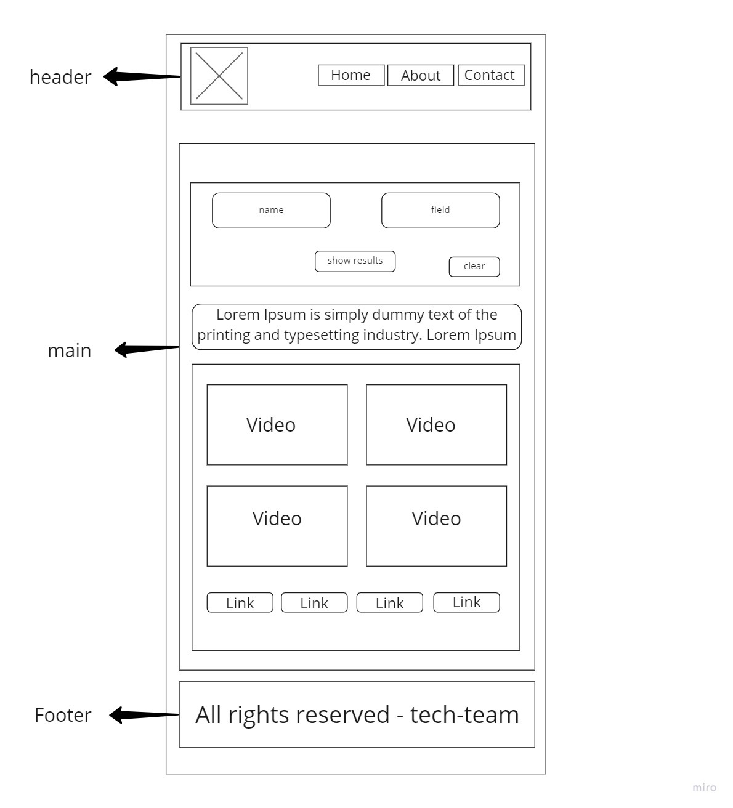

# tawjihi-sources

# team members

Mu'men Al-Madaineh (leader) PR owner JAVA SCRIPT

sarah Darwish CSS design

mhammad alkhateeb JAVA SCRIPT

Emadeddin Beshtawi  JAVA SCRIPT

Sara Kafaween CSS design

Baraah Hableh HTML and wireframe

# describe tawjihi sources project

A website that shows the 3 majors of the secondary School (TAWJIHI) students to save time and provide them the best content in terms of their major.

# wireframe

[wireframe link](https://miro.com/app/board/o9J_l262ICY=/)

;
